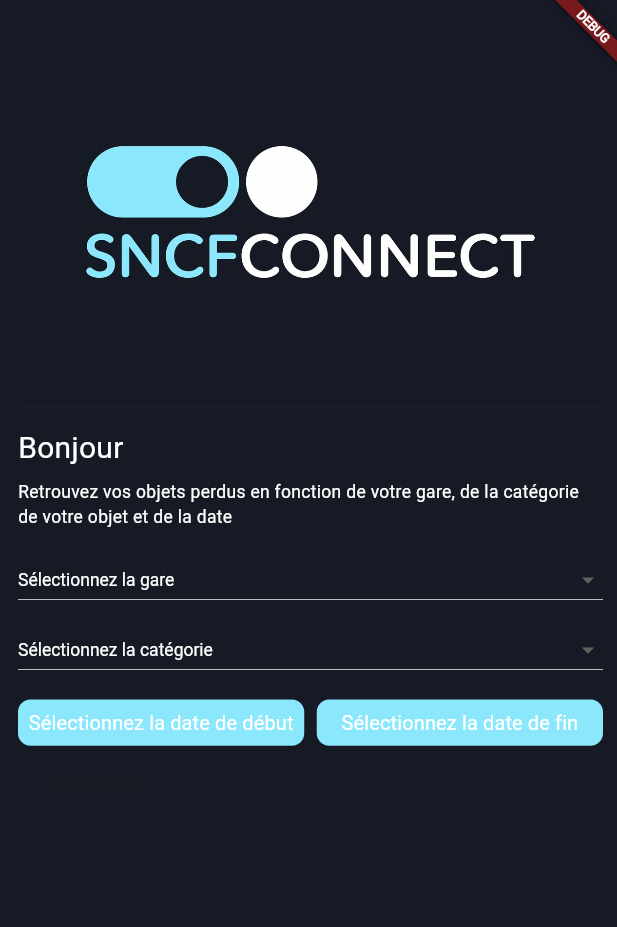
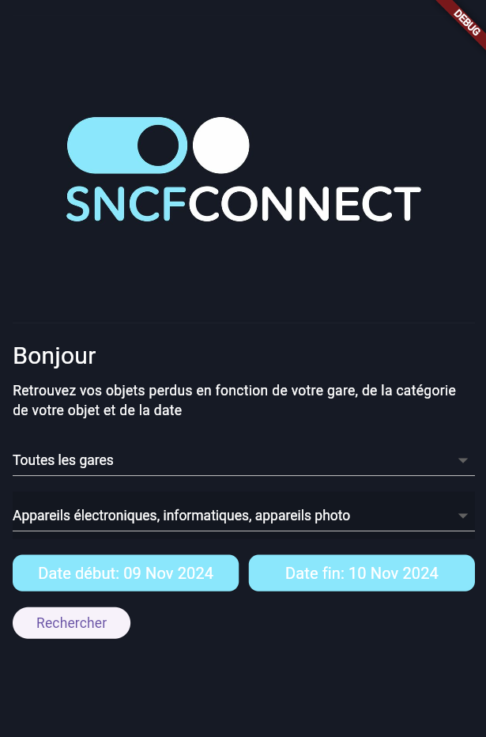
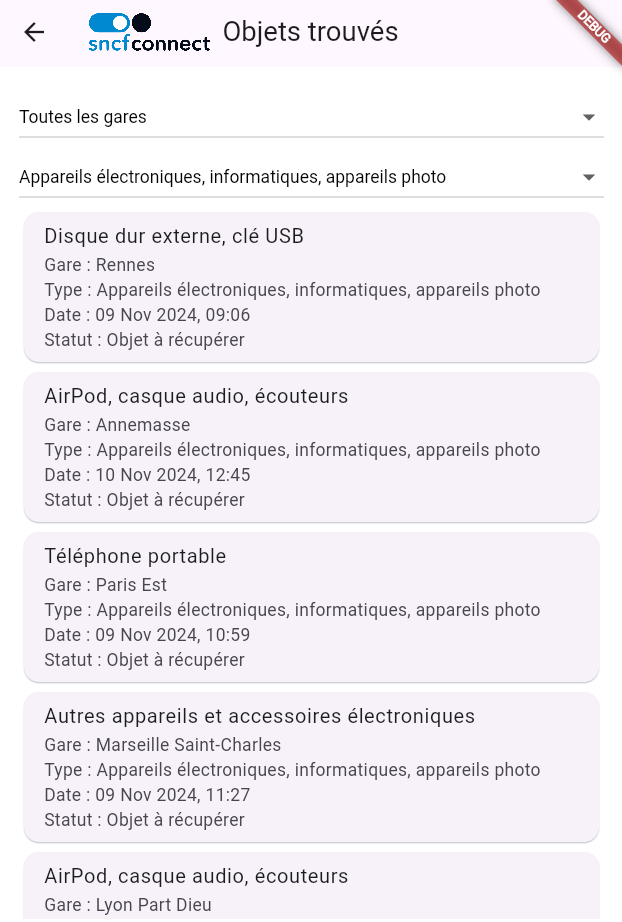

# Application Objets Trouvés SNCF

Cette application mobile permet aux voyageurs de rechercher facilement des objets perdus dans les trains SNCF. Les utilisateurs peuvent filtrer les résultats de recherche par gare, type d’objet et plage de dates, et consulter les détails des objets trouvés, notamment la gare où ils ont été récupérés et leur statut. Cette application est développée avec Flutter et utilise l'API SNCF pour récupérer les données.

## Table des matières

- [Fonctionnalités](#fonctionnalités)
- [Captures d'écran](#captures-décran)
- [Prise en main](#prise-en-main)
- [Technologies utilisées](#technologies-utilisées)

## Fonctionnalités

- **Recherche par Gare** : Sélectionnez une gare pour afficher les objets trouvés dans cette gare.
- **Filtrage par Type d’Objet** : Filtrez les objets par catégorie (ex. : bagages, vêtements, etc.).
- **Recherche par Plage de Dates** : Choisissez une période pour affiner la recherche des objets trouvés.
- **Affichage des Détails des Objets** : Visualisez les informations détaillées, y compris la date de récupération et le statut de l'objet.

## Captures d'écran






## Prise en main

### Prérequis

- **Flutter SDK** : Installez Flutter en suivant les instructions sur [flutter.dev](https://flutter.dev).

### Installation

1. Clonez ce dépôt :
   ```bash
   git clone https://github.com/Elogrz/objets_trouves_sncf.git
   ```
2. Accédez au dossier du projet :
   ```bash
   cd objets_trouves_sncf
   ```
3. Installez les dépendances :
   ```bash
   flutter pub get
   ```
4. Lancez l’application sur un émulateur ou un appareil physique :
   ```bash
   flutter run
   ```

## Technologies utilisées

- **Flutter** - Framework pour le développement d’applications multiplateformes.
- **Dart** - Langage de programmation utilisé par Flutter.
- **API SNCF** - Fournit les données sur les objets trouvés.